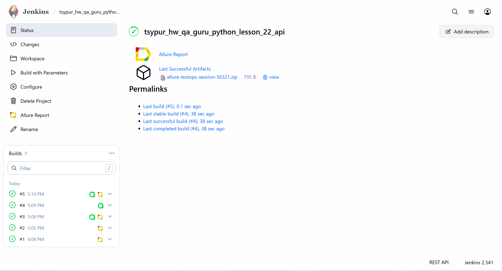
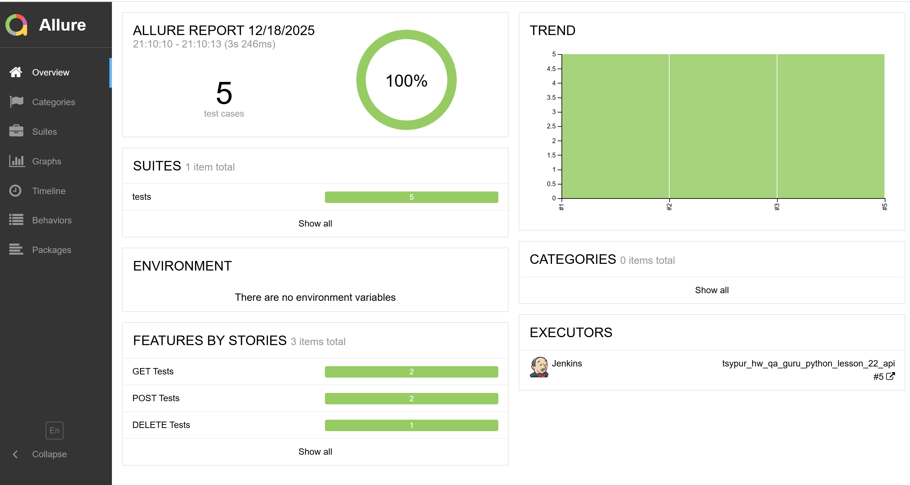
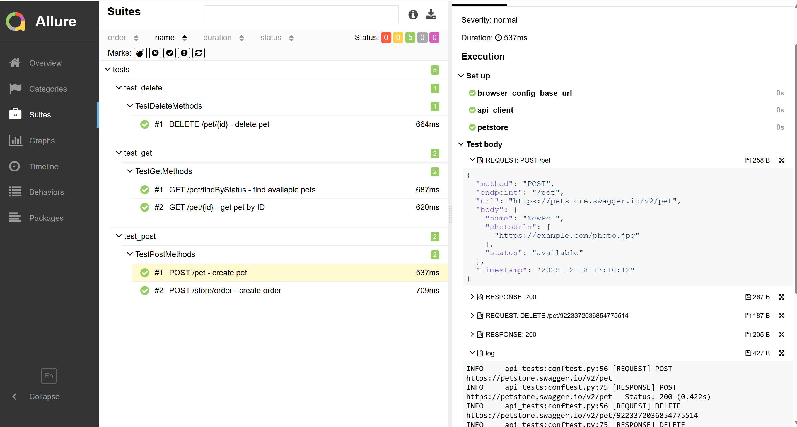
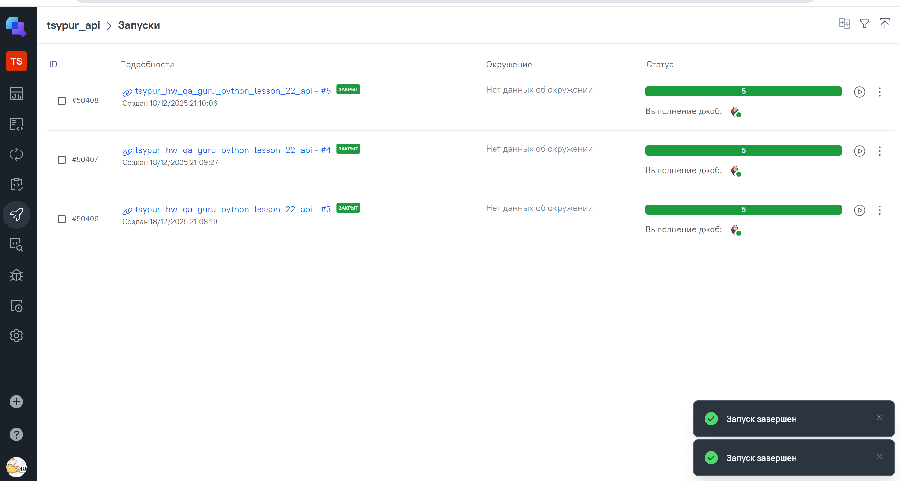
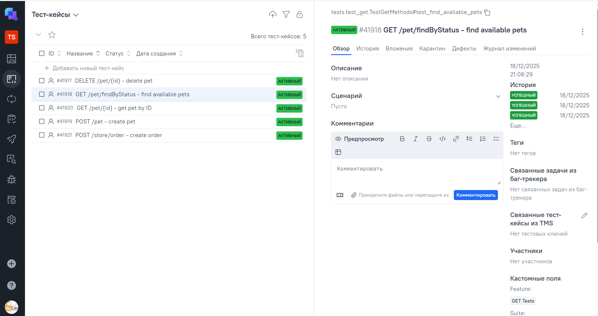
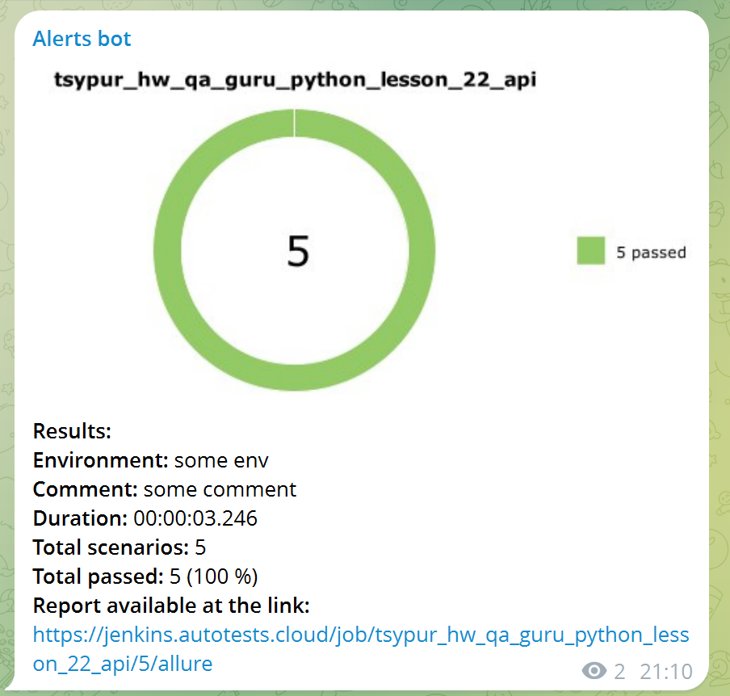

# API tests automation для проекта Pet Store

> web-сайт [Pet Store demo API](https://petstore.swagger.io)

## Содержание проекта

Фреймворк для автоматизации тестирования API с интеграцией с корпоративными сервисами включающий:

- **Pydantic schemas** 
- **Allure reporting**
- **Endpoint architecture** 
- **Telegram notifications** 
- **TestOps integration** 
- **Jenkins pipeline** 

---

## Используемый стек

<p align="center">
<a href="https://www.jetbrains.com/pycharm/"></a>
<a href="https://www.python.com/"></a>
<a href="https://github.com/"></a>
<a href="https://docs.pytest.org/"></a>
<a href="https://github.com/allure-framework/allure2"></a>
<a href="https://www.jenkins.io/"></a>
<a href="https://qameta.io/"></a>
</p> 

---

## Запуск теста

### Установка

```bash
# 1. Склонировать репозиторий
git clone https://github.com/tsypur/hw_qa_guru_python_lesson_22_api
cd hw_qa_guru_python_lesson_22_api

# 2. Создание виртуального окружения
python -m venv venv

# 3. Активация виртуального окружения
# macOS / Linux:
source venv/bin/activate
# Windows:
venv\Scripts\activate

# 4. Установка зависимостей
pip install -r requirements.txt
```

### Запуск тестов
```bash
# Запуск всех тестов
pytest --alluredir=allure-results

# Запуск конкретных тестов
pytest tests/test_get.py -v

# Просмотр Allure report
allure serve allure-results
```

---

### Примеры отчётов

#### </a> <a target="_blank" href="https://jenkins.autotests.cloud/job/C11-voronirina-diploma-UI/46/allure/">Allure Report</a> [Jenkins](https://jenkins.autotests.cloud/job/tsypur_hw_qa_guru_python_lesson_22_api/) Build



#### Allure Overview  


#### Детали тестового прогона


#### </a> <a target="_blank" href="https://allure.autotests.cloud/launch/38541/">TestOps</a> [TestOps](https://allure.autotests.cloud/project/5057/dashboards) Runs



#### Тест-кейсы TestOps



#### Telegram Notification
